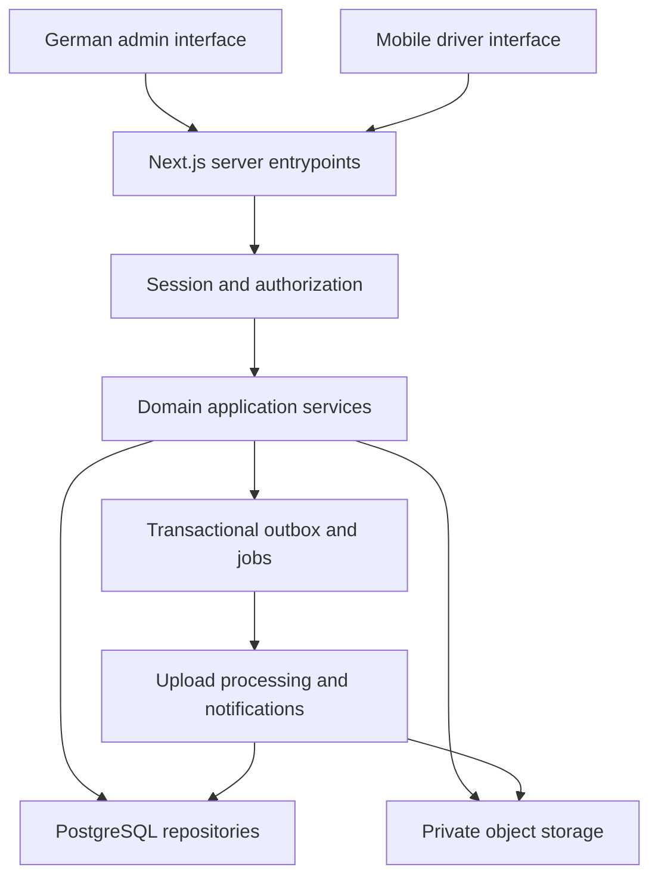

> Design baseline. Read `RELEASE_STATUS.md`, `API.md` and `OPERATIONS.md` for the current implementation and remaining gaps. Some decisions below describe the intended v1 target.

# Proposed architecture

Status: design for review; no implementation yet.

## Boundaries

Use one domain-oriented repository with Next.js entrypoints. Feature modules expose application services; HTTP handlers and Server Actions validate transport inputs, resolve the authenticated principal, call those services, and serialize explicit DTOs. UI modules never query the database directly from the browser.

The browser, application, database, storage and external email provider are separate trust boundaries. Administrative access is not a bypass of organization ownership checks.

## Directory responsibilities

| Location                 | Responsibility                                                     |
| ------------------------ | ------------------------------------------------------------------ |
| src/app/(auth)           | Sign-in, invitation, recovery and MFA screens                      |
| src/app/(admin)          | Administrative layout and module routes                            |
| src/app/(driver)         | Mobile layout and own-data routes                                  |
| src/app/api/v1           | Versioned external contracts; use shared services                  |
| src/features/{domain}    | Domain validation, application services, repositories, DTOs and UI |
| src/server/auth          | Mature authentication integration and principal construction       |
| src/server/authorization | Permission and resource-ownership policy                           |
| src/server/db            | Database connection and transaction entrypoints                    |
| src/server/storage       | Quarantine, authorized retrieval and processing adapters           |
| src/server/audit         | Append-only audit writes and restricted reads                      |
| src/server/jobs          | Durable outbox, retries, leases and scheduled jobs                 |
| src/server/observability | Structured events and correlation IDs                              |
| src/components/ui        | Accessible primitives with shared tokens                           |
| src/messages/de          | German text dictionary; no scattered application strings           |
| prisma/migrations        | Reviewed schema changes and SQL constraints                        |
| tests                    | Cross-module database, authorization, abuse and browser scenarios  |

Prefer module-local files named for their purpose. Do not create every possible interface before it has an implementation need. Repositories accept an already validated server-side organization scope; services still enforce the specific resource permission.

## Critical flows

**Vehicle assignment:** resolve permission → begin transaction → lock relevant vehicle and driver consistently → validate active state and no conflicting assignment → insert assignment/history and audit/outbox → commit. Unique/exclusion constraints provide a second barrier against races. Map a constraint conflict to a helpful German message. Availability is derived from operational state and current assignments, not a separately editable boolean.

**Remove assignment:** close its interval and record actor/reason atomically. The vehicle becomes available only if still active and not blocked by another operational state. Never erase assignment history.

**Score import:** authorized upload into quarantine → bounded format validation and parsing → draft mapping/preview with row errors → admin confirmation → reauthorize and revalidate draft version → transactional revision commit → audit and completion notification. Hashes and idempotency keys prevent duplicate commits. Supersede or revert a whole published revision; do not overwrite an unexplained subset of rows.

**Driver score:** use driver profile linked to the authenticated membership, with organization plus driver filters applied by the repository. A requested week changes only the period. Return only that driver's metrics and source-provided rank; no other driver identities or score rows.

**Files:** authenticate before upload; after upload inspect bytes, enforce processing budgets and quarantine. Store object identifiers in PostgreSQL. Retrieval checks the associated driver's/vehicle's permissions at request time. URLs have short expiry and are never used as permanent authorization.

## Business defaults proposed for v1.0

- Organization timezone Europe/Berlin; UTC instants in storage. ISO weeks start Monday and include ISO week-year.
- One current operational vehicle per driver and one current driver per vehicle. Scheduled planning is separate from physical handover. If multi-driver simultaneous use is required, revise this invariant before assignments are implemented.
- Returning a defleeted vehicle creates a new service period; it does not remove its previous departure date.
- Four physical key slots maximum initially. Each key has its own custody history.
- Unknown score values remain unavailable. Zero is a real value. No invented total-score, bonus or rank formula.
- Work-time edits preserve revision history. This module is operational record keeping; no payroll calculation is inferred.
- Document expiry alerts default to 30 days, configurable by organization. Retention requires an explicit organizational policy before real personal data is loaded.
- No direct messaging to anyone has been performed by this research task.

## Delivery stages and exit conditions

| Stage | Scope                                                          | Evidence required before moving on                                                                |
| ----- | -------------------------------------------------------------- | ------------------------------------------------------------------------------------------------- |
| 0     | Finish release/API research, review architecture and design    | Closed dependency research gaps; agreed invariants; implementation plan                           |
| 1     | Database, authentication, authorization, German shell, logging | Real PostgreSQL migrations; login/recovery/MFA tests; cross-tenant denial                         |
| 2     | Drivers, vehicle categories/lifecycle, assignments, keys       | CRUD and archive tests; race tests; immutable history; keyboard flows                             |
| 3     | Uploads, photo/damage reports, documents                       | Private download checks; malicious/oversized upload rejection; expiry jobs                        |
| 4     | Score import and mobile driver score/PHR/Concessions           | Preview/commit/revert; workbook acceptance; driver IDOR and response inspection                   |
| 5     | Plan, waves, work times, inventory                             | State-transition, overlap, correction and stock-race tests                                        |
| 6     | Messages, notifications, reports, dashboard                    | Participant access; deduplication; safe exports; real aggregate queries                           |
| 7     | Integrated release and operations                              | Full required tests, build/scans, accessibility review, restore rehearsal, complete documentation |

All stages contribute to v1.0.0. Passing stage 2 is not a completed v1.0.0. Screenshots, deployment instructions and the extension guide must reflect the final running implementation.

## Deployment and extension points

Proposed deployment: TLS reverse proxy/platform, Node app, PostgreSQL, private object storage, job runner and email provider. Separate application and migration database roles. Use forward migrations with backups and tested recovery; destructive downgrades are not the default rollback strategy.

Expose integration boundaries for storage, email, monitoring, import mappings and notification delivery. Add score metrics through versioned metric definitions. Add permissions through centralized policy plus matrix tests. Add languages through dictionaries and locale formatting. No generic plugin execution engine is needed.
