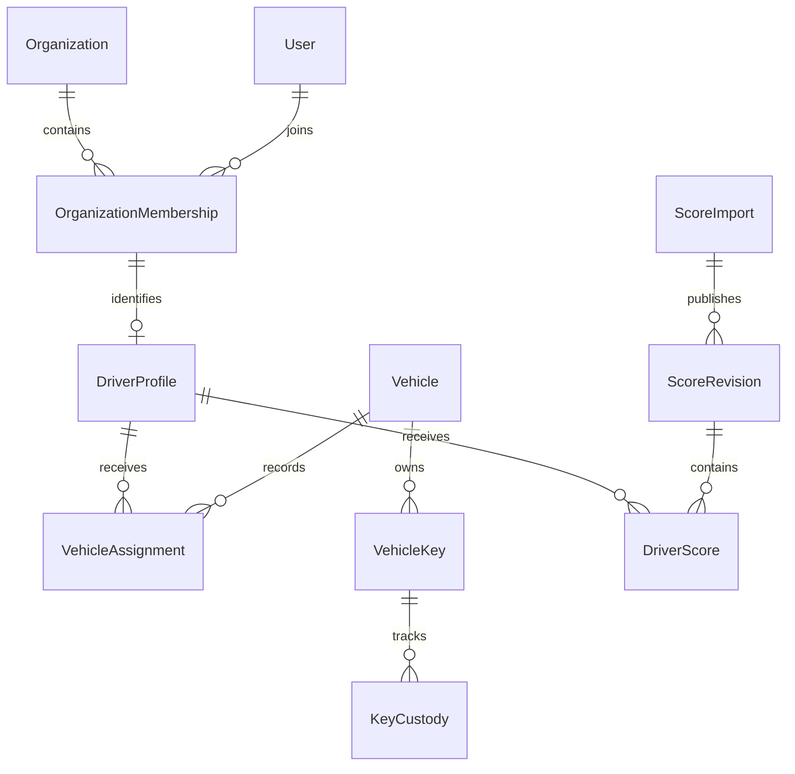

> Design baseline. Read `RELEASE_STATUS.md`, `API.md` and `OPERATIONS.md` for the current implementation and remaining gaps. Some decisions below describe the intended v1 target.

# Initial data model

Proposed logical schema, not executable migrations. Every organization-owned row carries organizationId. Composite unique keys on (organizationId, id) permit composite foreign keys that prevent cross-tenant associations, even when a programming error supplies an otherwise valid ID.

## Entity groups

| Domain           | Entities and key relationships                                                                                                                                                                                       |
| ---------------- | -------------------------------------------------------------------------------------------------------------------------------------------------------------------------------------------------------------------- |
| Identity         | Organization; User; OrganizationMembership(user, organization); Role; Permission; MembershipRole; RolePermission; provider-owned Session/Account/Verification/MFA records                                            |
| Drivers          | DriverProfile → OrganizationMembership; unique organization/transporter ID when supplied; active/archive state                                                                                                       |
| Fleet            | Vehicle → VehicleBrand, optional VehicleProvider, Station, VehicleGroup; VehicleServicePeriod → Vehicle; VehicleStatusEvent                                                                                          |
| Assignments      | VehicleAssignment → Vehicle + DriverProfile; start/end interval; actor and closure reason; optional PlanEvent link                                                                                                   |
| Keys             | VehicleKey → Vehicle; KeyCustody → VehicleKey + optional DriverProfile; OFFICE/DRIVER/MISSING state and interval                                                                                                     |
| Photos/damage    | VehiclePhotoReport → Vehicle + reporter; VehiclePhoto → report + StoredObject; VehicleDamage → Vehicle + report; DamagePhoto links damage to photo                                                                   |
| Scores           | ScoreImport → source StoredObject; ScoreImportMapping version; ScorePeriod(year, week); ScoreRevision → period/import; DriverScore → revision + DriverProfile; ScoreMetric definition; DriverScoreMetric typed value |
| Delivery details | PhrEntry → DriverProfile + optional score revision; ConcessionEntry → same; business date, bounded source fields and source reference                                                                                |
| Planning/waves   | PlanEvent → optional driver/vehicle/assignment; Wave; WaveParticipant → wave + driver/vehicle                                                                                                                        |
| Work time        | WorkTimeEntry → driver; WorkTimeRevision → entry; approval actor and timestamp                                                                                                                                       |
| Inventory        | InventoryItem; InventoryMovement → item; InventoryCustody → item + optional driver/vehicle                                                                                                                           |
| Documents        | Document → driver or vehicle; DocumentVersion → Document + StoredObject; expiry and renewal lineage                                                                                                                  |
| Messages         | MessageThread; ThreadParticipant; Message → thread + sender; participant read cursor                                                                                                                                 |
| Notifications    | Notification → recipient membership; source event and deduplication key                                                                                                                                              |
| Infrastructure   | StoredObject; AuditLog; SecurityEvent; OutboxEvent; Job; idempotency records                                                                                                                                         |

The extra membership, revision, custody, file and participation entities close gaps in the minimum entity list. A single global role field cannot safely model future organization-specific membership.

## Types and constraints

- UUID primary identifiers; createdAt/updatedAt instants plus actor fields where appropriate. Human labels such as Kennzeichen are searchable identifiers, not immutable foreign keys.
- Normalize plates for organization-scoped active uniqueness. Store plate history to avoid attributing old events to a reused plate. VIN required, normalized uppercase and organization-scoped unique. Decide legacy/non-standard VIN handling explicitly; do not silently discard imported historical vehicles.
- Ownership is a protected system enum: OWNED, RENTED, LEASED. RENTED requires providerId. Owned vehicles must not accidentally retain stale rental form values.
- Use date for In-Fleet/De-Fleet, expiry and source business dates; timestamptz for actual events. Service-period departure must be on/after entry. Only one open fleet service period per vehicle.
- Partial unique constraints prevent multiple open operational assignments for a vehicle or driver. Planned ranges need overlap validation if reservations are introduced. Use custom reviewed PostgreSQL migrations when ORM schema features are insufficient.
- Unique (organizationId, vehicleId, slot), with slot 1–4. At most one open custody interval per key. DRIVER custody requires an in-organization driver; OFFICE/MISSING must not retain a current driver.
- DriverScore unique per (organization, revision, driver). Metric values use decimal/count/text columns with type validation, not floating-point bonus arithmetic. Preserve source labels, units and provenance. Source missingness is explicit.
- A ScorePeriod includes ISO week-year and week, validated against that year. One current published revision per period; old revisions remain auditable. A revert restores a complete prior revision atomically and records why.
- Message membership must be checked for both reads and sends. The browser cannot choose an arbitrary sender ID.
- Documents have one primary subject (driver or vehicle), enforced by a check constraint. Each version links to a private object; renewal does not mutate the old bytes.
- Work-time end must follow start; breaks cannot exceed elapsed time. Cross-midnight and daylight-saving transitions use instants. Prevent overlapping active records for one employee and reject edits to an approved entry unless a correction revision is created.
- Stock movements are signed quantities with reason/actor and idempotency. Transactionally prevent negative available stock. Custody and consumption are different operations.

## Index and consistency plan

Start list indexes with organizationId and the real filter/sort fields, ending with a deterministic ID tie-breaker. Examples: vehicle status/plate, assignment vehicle/start, driver score period/driver, documents expiry, notifications recipient/read/created, messages thread/created.

Cursor pagination must retain authorization and filters. Search extensions and query plans are implementation decisions to benchmark with realistic seeds. Do not promise arbitrary large-table performance from an index list alone.

Audit events and outbox writes commit with the business mutation. File-byte transfer is outside the PostgreSQL transaction; use explicit pending/quarantined/ready/rejected states and clean abandoned objects asynchronously. Referenced ready objects cannot be replaced by another tenant's object key.

## Historical integrity

Archive drivers, vehicles and categories. Preserve assignment and key intervals, score revisions and document versions. Personal-data retention is separate from indefinite operational history: pseudonymization/deletion must follow an approved retention policy, with narrowly limited identifiers retained only where justified. This is a design requirement, not a claim of legal compliance.
